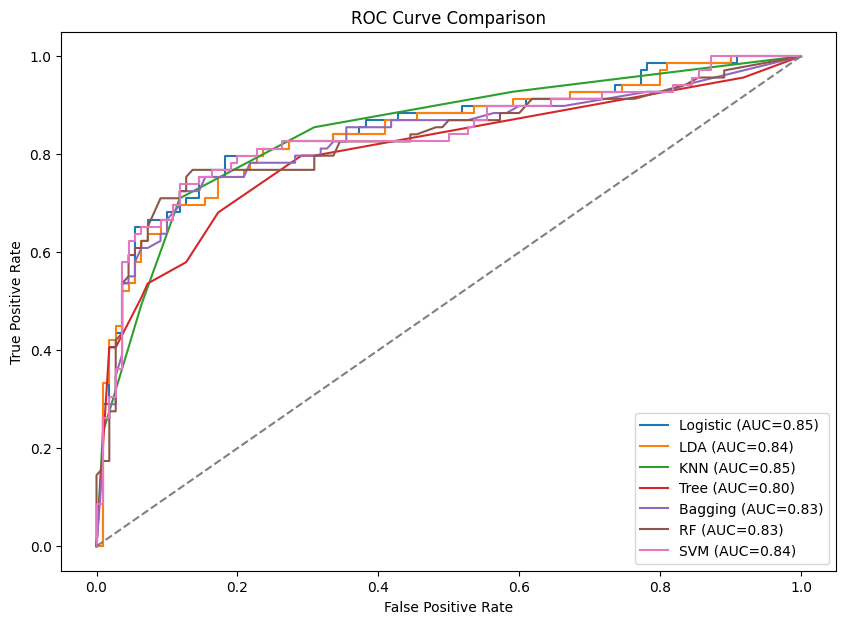
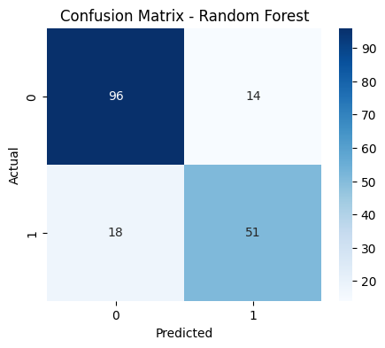
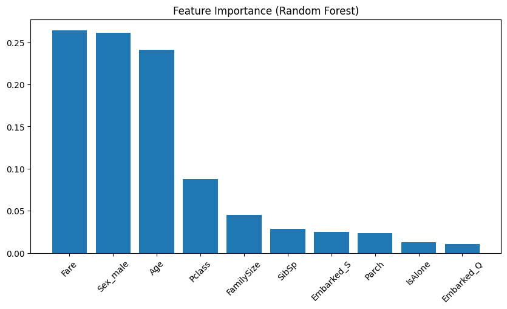
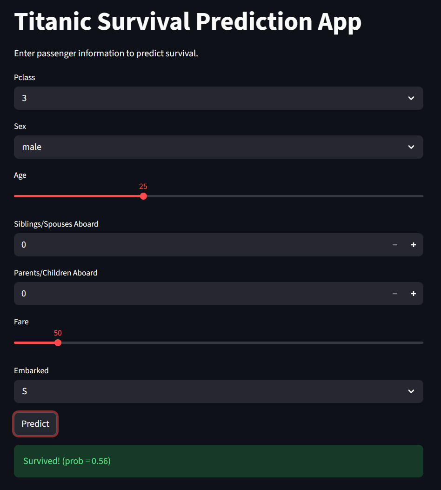

# Titanic ML Project — 

---

# Project Overview

This project is a complete end-to-end machine learning pipeline that predicts Titanic survival outcomes.

It includes:
- Data preprocessing
- Feature engineering
- Multiple ML models
- Model evaluation
- Web deployment (Streamlit)

---

# Goal

Build a production-style ML pipeline:

Data → Preprocessing → Feature Engineering → Model Training → Evaluation → Deployment

---

# Problem Type

Binary Classification

Target: Survived (0 = No, 1 = Yes)

---

# Models

- Logistic Regression
- LDA
- KNN
- Decision Tree
- Bagging
- Random Forest
- SVM

---

# Pipeline

Data Loading
→ Missing Value Handling
→ Feature Engineering
→ Train/Test Split
→ Model Training
→ Evaluation
→ Prediction

---

# Key Results

Best Model: Random Forest / SVM (depending on run)

## ROC Curve


## Confusion Matrix


## Feature Importance


---

## Demo



---

# Feature Importance

Top features:
- Sex
- Pclass
- Fare
- Age

---

# Streamlit App

Run locally:
```bash
streamlit run app.py
```

Features:
- User input form
- Real-time prediction
- Survival probability

---

# How to Run

```bash
pip install -r requirements.txt
python src/train.py
python src/predict.py
streamlit run app.py
```

---

# Tech Stack

Python, Pandas, NumPy, Scikit-learn, Matplotlib, Seaborn, Streamlit

---

# Key Learnings

- End-to-end ML pipeline design
- Feature engineering impact
- Model comparison
- Overfitting control
- Basic deployment

---

# Author

HubertKuo

---

# Future Improvements

- Hyperparameter tuning
- Cross-validation